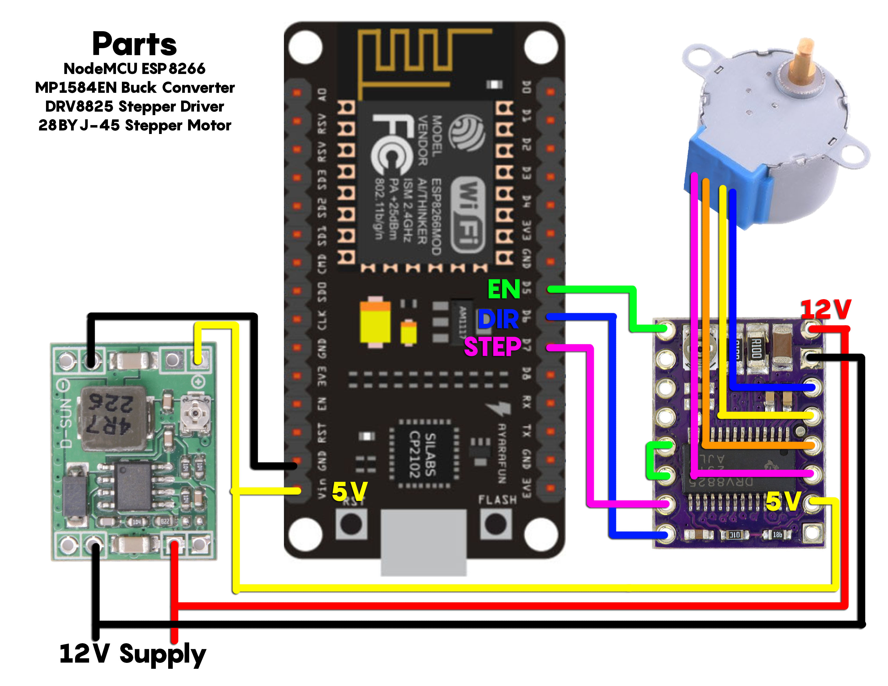

# Motorized_MQTT_Blinds

### THIS IS A FORK OF ROB'S CODE FROM THE HOOK UP: [MOTORIZED MQTT BLINDS PROJECT](https://github.com/thehookup/Motorized_MQTT_Blinds/)

______________________________________________

## The Original Video
This repository is to accompany Rob's Motorized_MQTT_Blinds video:

[](https://www.youtube.com/watch?v=1O_1gUFumQM)

## Parts List
*Affiliate links to support Rob!*

Stepper Motors: https://amzn.to/2D5rVsF

Stepper Drivers: https://amzn.to/2OZqW1W

NodeMCU: https://amzn.to/2I89xDF

12V Power Supply: https://amzn.to/2G2ZJrf

Buck Converter: https://amzn.to/2UsQ7jA

## 3D Printing

Download the correct STL file(s) for your style of tilt rod. You will find all the 3D Print file in the `extra/files` folder.

## Wiring Schematic



**Dont forget to cut the center trace on the stepper motor as shown in the youtube video**

## How to setup, build, and flash this image

I recommend using VSCode with the PlatformIO extension. So these instructions will only support this method:

## First-Time Setup
1) Clone the project or download/unzip the files from the browser
2) Open in VSCode
3) Rename `user_config.h.sample` to `user_config.h`
4) Fill out `user_config.h` with your information for your setup.
5) When you are ready to build, click on the PlatformIO icon in the left panel.
6) In the Project Tasks window, drill into `env:d1_mini`* > General > Click Build!
7) You will find your new bin file in the `build/d1_mini` folder.
8) Plugin your device and use some kind of flashing tool to do your initial flash. Recommended: [Tasmotizer](https://github.com/tasmota/tasmotizer)

\* = While the project actually uses a Wemos D1 Mini, this code should still work with no issues on a NodeMCU like in the schematic picture.

You should leave "STEPS_TO_CLOSE" at 12 to start with.  It can be adjusted for your specific blinds

## OTA Updates
For future updates it is easier to update them in place rather than taking down the blinds and re-flashing. I could never get ArduinoOTA to work for me, so instead I changed to using an HTTP Update Server.

1) Get your bin file following steps 1-7 above.
2) Get the IP address of the device on your network.
3) Navigate to http://YOUR-DEVICE-IP/firmware (unless you changed the update path in your `user_config.h` file)
4) Click browse under `Firmware` and locate your new bin file
5) Click 'Update Firmware'
6) It will likely redirect you to a 404 page after it successfully updates. However, it should have updated successfully.

## Home Assistant YAML

Replace "BlindsMCU" with your MQTT_CLIENT_ID if you changed it in the file setup

```yaml
cover:
  - platform: mqtt
    name: "Motorized Blinds"
    command_topic: "BlindsMCU/blindsCommand"
    set_position_topic: "BlindsMCU/positionCommand"
    position_topic: "BlindsMCU/positionState"
    state_topic: "BlindsMCU/positionState"
    retain: true
    payload_open: "OPEN"
    payload_close: "CLOSE"
    payload_stop: "STOP"
    position_open: 0
    position_closed: 12
  ```

  If you changed your "STEPS_TO_CLOSE" in your `user_config.h` file then make sure to update the `position_closed` value here.

## KNOWN ISSUES:
* Blinds default to the `Open` position when they reboot for some reason.
  * This is my main reason for forking this project. So expect it to be fixed soon hopefully.
  
## Recommended Tools

Ender3 3d Printer: https://amzn.to/2GcznnZ

Dupont Crimper and Connector Set: https://amzn.to/2X1Oeap

## Unlike Rob, I do not support an Alexa based code-base.
